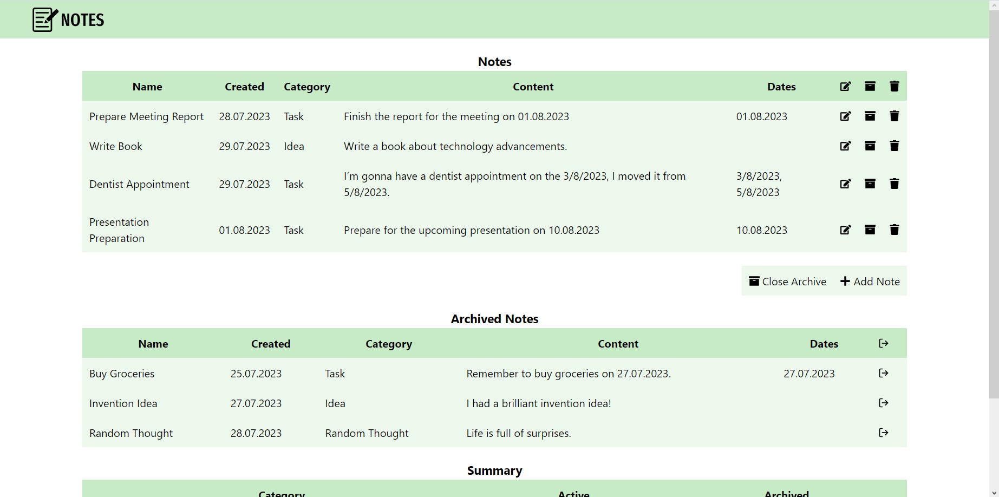
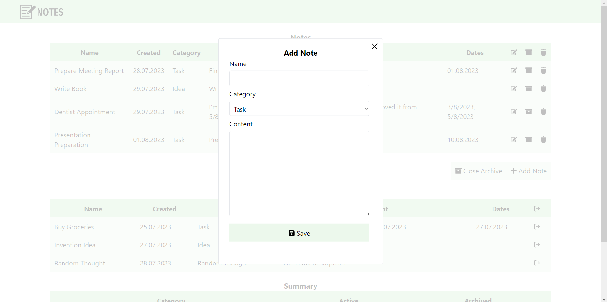

# Notes

This repository holds front-end of the Note App. It's back-end available by [link](https://github.com/marharita08/notes-express).

The Notes App is an application that allows users to manage their notes effectively. Users can add, edit, and delete notes, which are displayed in the form of a table. Additionally, notes can be archived and unarchived for better organization. Archived notes are displayed in a separate table, which is hidden by default.

## Features

- **Add Note**: Users can create new notes by providing a name, category and content. Once added, the note will appear in the main table.
- **Edit Note**: Existing active notes can be edited to update their name, category or content.
- **Delete Note**: If a note is no longer needed, users can delete it from the main table.
- **Archive Note**: Users can archive a note to move it from the main table to the archived table.
- **Unarchive Note**: If needed, archived notes can be unarchived and returned to the main table. The unarchived note will be available for regular editing and viewing.

## Technologies Used

- TypeScript
- React
- Redux
- Tailwind CSS

## Prerequisites

Before running the application, make sure you have the Node.js installed.

## Installation

1. Install and run [back-end](https://github.com/marharita08/notes-express).
2. Clone project from repository `git clone https://github.com/marharita08/notes-react`.
3. Navigate to project folder `cd notes-react`.
4. Install the necessary npm packages `npm install`.
5. Update `.env` if it is necessary.
6. Run the application `npm start`.
7. Once the application is running, open your web browser and go to `http://localhost:3000/`.

## Usage

1. **Add a New Note**
    - Click on the "Add Note" button.
    - Enter a name and content, choose category for the new note.
    - Click "Save" button to add the note to the main table.

2. **Edit a Note**
    - In the main table, locate the note you wish to edit.
    - Click "Edit" icon to copy note to modal.
    - Make the necessary changes.
    - Click "Save" button to apply the modifications.

3. **Delete a Note**
    - In the main table, find the note you want to delete.
    - Click the "Delete" icon associated with the note.

4. **Archive/Unarchive a Note**
    - In the main table, locate the note you want to archive.
    - Click the "Archive" icon associated with the note to move it to the archived table.
    - In the archived table, locate the note you want to unarchive.
    - Click the "Unarchive" icon associated with the note to move it back to the main table.

## Screenshots

